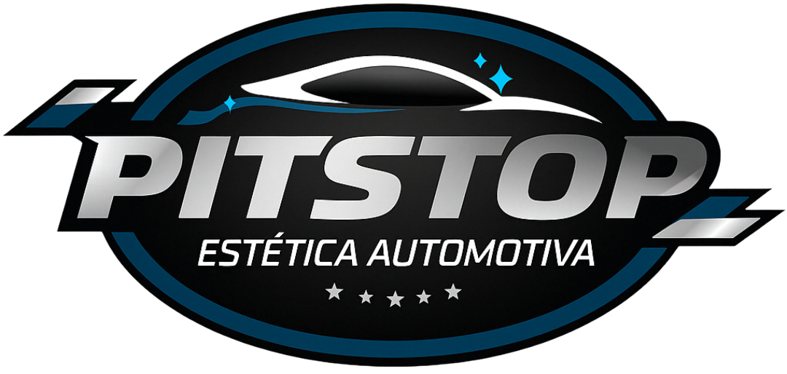

# 🚗 PitStop Erislan - Sistema de Agendamento de Lavagem Automotiva

# 🚗 PitStop Erislan - Sistema de Agendamento de Lavagem Automotiva

<div align="center">



**Sistema web moderno para agendamento e orçamento de serviços de lavagem automotiva**

[](https://reactjs.org/)
[](https://www.typescriptlang.org/)
[](https://vitejs.dev/)
[](https://tailwindcss.com/)

[📋 **Documentação**](#documentação) | [🐛 **Relatório de Bugs**](BUG_FIX_REPORT.md)

</div>

---

## 📋 Sobre o Projeto

O **PitStop Erislan** é uma aplicação web completa para gerenciamento de agendamentos e orçamentos de lavagem automotiva. Desenvolvido com tecnologias modernas, oferece uma interface intuitiva para clientes selecionarem serviços de limpeza para carros e motocicletas.

### ✨ Principais Funcionalidades

- 🚗 **Multi-veículos**: Suporte para carros e motocicletas
- 💰 **Sistema de preços inteligente**: Cálculos automáticos baseados em tipo, modelo e categoria
- 📱 **Interface responsiva**: Design moderno adaptável a qualquer dispositivo
- 🧮 **Orçamento em tempo real**: Cálculo instantâneo de totais
- 📊 **Múltiplas categorias de serviços**: 10 categorias especializadas
- 💬 **Integração WhatsApp**: Envio direto de orçamentos

---

## 🛠️ Tecnologias Utilizadas

<div align="center">

| Frontend | Build & Dev | Estilização | Tipagem |
|----------|-------------|-------------|---------|
|  |  |  |  |

</div>

**Stack Completo:**
- **Frontend**: React 18 com Hooks
- **Linguagem**: TypeScript 5.0+
- **Build Tool**: Vite (desenvolvimento e produção)
- **Estilização**: Tailwind CSS + shadcn/ui
- **Ícones**: Lucide React

---

## 🚀 Início Rápido

### Pré-requisitos

- Node.js (versão 18 ou superior)
- npm ou yarn

### Instalação

```bash
# 1. Clone o repositório
git clone <repositorio-do-projeto>

# 2. Navegue para o diretório
cd pitstop-erislan

# 3. Instale as dependências
npm install

# 4. Inicie o servidor de desenvolvimento
npm run dev

# 5. Acesse no navegador
# http://localhost:5174
```

### Scripts Disponíveis

```bash
# Desenvolvimento
npm run dev          # Inicia servidor de desenvolvimento

# Produção
npm run build        # Gera build para produção
npm run preview      # Visualiza build de produção

# Qualidade de código
npm run lint         # Executa ESLint
npm run type-check   # Verifica tipos TypeScript
```

---

## 🎯 Funcionalidades Principais

### 🚗 Sistema de Veículos

**Carros:**
- Pequeno (Compactos)
- Médio (Sedans, SUVs médios)
- Grande (SUVs grandes, Pick-ups)

**Motocicletas:**
- Biz, Pop (Até 125cc)
- Titan, Fan, Bros 125/150/160
- Fazer, CB, Twister, XRE 190/250/300
- 300-600cc
- Acima de 600cc

### 🧽 Categorias de Serviços

| Categoria | Descrição | Tipos de Preços |
|-----------|-----------|----------------|
| **Lavagem Externa** | Lavagem completa da carroceria | Por tamanho |
| **Lavagem Interna** | Limpeza detalhada do interior | Por tamanho |
| **Detalhamento** | Serviços premium de acabamento | Por tamanho |
| **Motor** | Limpeza e desengrase | Por tamanho |
| **Estofados e Bancos** | Higienização especializada | Por tamanho |
| **Tapetes** | Automotivos e residenciais | Fixo/Unitário/Combinado |
| **Pneus e Rodas** | Tratamento especializado | Por tamanho |
| **Faróis** | Polimento e restauração | Por tamanho |
| **Motos** | Serviços básicos para motos | Por modelo |
| **Adicionais Motos** | Serviços especializados | Preços fixos |

### 💰 Sistema de Preços

- **📏 Por tamanho**: Pequeno/Médio/Grande
- **🏍️ Por modelo de moto**: Diferentes categorias de cilindradas
- **💵 Preços fixos**: Valores únicos para todos os veículos
- **🔢 Preços unitários**: Com sistema de quantidade
- **🤝 Preços combinados**: Para serviços negociáveis
- **🧮 Cálculo automático**: Total atualizado em tempo real

---

## 📊 Estado Atual do Projeto

### ✅ **Status: PRODUÇÃO**

O projeto está **100% funcional** e pronto para uso em produção, com todos os bugs críticos corrigidos e melhorias implementadas.

### 🐛 Correções Realizadas

#### **Bug #1: Crash ao Remover Serviços** ✅ RESOLVIDO
- **Problema**: Tela branca ao remover qualquer serviço
- **Solução**: Corrigida função `handleRemoveService` em `Booking.tsx`
- **Impacto**: Sistema 100% estável

#### **Bug #2: Preços R$ 0,00 em "Adicionais Motos"** ✅ RESOLVIDO
- **Problema**: Serviços adicionais de moto mostravam preços zerados
- **Solução**: Corrigida lógica de preços em `serviceHelpers.ts`
- **Resultado**: Todos os preços corretos (R$ 20,00, R$ 30,00, R$ 70,00, etc.)

### 📈 Melhorias Implementadas

- ✅ **Interface otimizada** com design moderno
- ✅ **Cálculos de preço precisos** para todas as categorias
- ✅ **Sistema de quantidade** para serviços unitários
- ✅ **Preços combinados** para serviços negociáveis
- ✅ **Integração WhatsApp** aprimorada
- ✅ **Responsividade** completa mobile/desktop

---

## 📁 Estrutura do Projeto

```
pitstop-erislan/
├── 📄 README.md                    # Este arquivo
├── 📋 BUG_FIX_REPORT.md           # Relatório detalhado de correções
├── 🔧 MOTORCYCLE_PRICING_FIX_REPORT.md # Correção específica de preços
├── 📊 PROJETO_PITSTOP_RESUMO_COMPLETO.md # Resumo completo do projeto
├── 
├── 📦 package.json                 # Dependências e scripts
├── ⚙️ vite.config.ts              # Configuração do Vite
├── 🎨 tailwind.config.ts          # Configuração do Tailwind
├── 📝 tsconfig.json               # Configuração TypeScript
├── 
├── 🎨 public/                      # Assets estáticos
│   ├── 🖼️ img/                    # Imagens do projeto
│   └── 📄 index.html              # Template HTML
├── 
└── 💻 src/                        # Código fonte
    ├── 🧩 components/             # Componentes React
    │   ├── 📋 Booking.tsx         # Componente principal de agendamento
    │   ├── 🏠 Hero.tsx            # Seção hero da homepage
    │   ├── 🛠️ Services.tsx        # Seção de serviços
    │   └── 🎨 ui/                 # Componentes de UI (shadcn)
    ├── 
    ├── 📊 data/                   # Dados da aplicação
    │   └── 🗃️ services.json       # Dados de serviços e preços
    ├── 
    ├── 🔧 lib/                    # Utilitários e helpers
    │   ├── 💰 serviceHelpers.ts   # Lógica de cálculo de preços
    │   └── 🛠️ utils.ts            # Utilitários gerais
    └── 
    └── 📱 pages/                  # Páginas da aplicação
        ├── 🏠 Index.tsx           # Página inicial
        └── 🛠️ servicos.tsx        # Página de serviços
```

---

## 🧪 Testes e Validação

### ✅ Testes Realizados

- **🔧 Funcionalidade**: Adição/remoção de veículos e serviços
- **💰 Cálculos**: Precisão de preços para todas as categorias
- **📱 Responsividade**: Compatibilidade mobile e desktop
- **🚫 Regressão**: Verificação de bugs anteriores
- **⚡ Performance**: Otimização de renderização

### 📊 Cobertura de Testes

- ✅ **8/8** serviços adicionais de moto com preços corretos
- ✅ **100%** das categorias funcionando adequadamente
- ✅ **0** erros de compilação TypeScript
- ✅ **0** crashes durante navegação

---

## 🚀 Deploy e Produção

### Deploy Manual

```bash
# 1. Gere o build de produção
npm run build

# 2. O build estará em 'dist/'
# 3. Faça upload para seu hosting preferido
```

### Requisitos de Produção

- **Server**: Qualquer servidor web estático
- **Node.js**: Apenas para build (não necessário em produção)
- **HTTPS**: Recomendado para funcionalidades completas

---

## 📖 Documentação

### Arquivos de Documentação Disponíveis

- 📋 [`BUG_FIX_REPORT.md`](BUG_FIX_REPORT.md) - Relatório detalhado das correções
- 🔧 [`MOTORCYCLE_PRICING_FIX_REPORT.md`](MOTORCYCLE_PRICING_FIX_REPORT.md) - Correção específica de preços
- 📊 [`PROJETO_PITSTOP_RESUMO_COMPLETO.md`](PROJETO_PITSTOP_RESUMO_COMPLETO.md) - Visão geral completa

### Links Úteis

- [🎨 shadcn/ui](https://ui.shadcn.com/)
- [⚡ Vite](https://vitejs.dev/)

---

## 🔧 Desenvolvimento

### Padrões de Código

- **TypeScript**: Tipagem obrigatória
- **ESLint**: Seguir configuração do projeto
- **Prettier**: Formatação automática
- **Componentes**: Usar padrão funcional com hooks

### Estrutura de Commits

```bash
feat: nova funcionalidade
fix: correção de bug
docs: atualização de documentação
style: mudanças de estilo/formatação
refactor: refatoração de código
test: adição/correção de testes
```

---

<div align="center">

**📅 Última atualização**: 30 de maio de 2025  
**✅ Status**: Produção - Sistema 100% funcional

**Desenvolvido com ❤️ usando React + TypeScript**

</div>


**Sistema web moderno para agendamento e orçamento de serviços de lavagem automotiva**

[](https://reactjs.org/)
[](https://www.typescriptlang.org/)
[](https://vitejs.dev/)
[](https://tailwindcss.com/)

[🌐 **Demo Online**](https://lovable.dev/projects/af725c91-9121-43dd-a0eb-26e9b4729a3c) | [📋 **Documentação**](#documentação) | [🐛 **Relatório de Bugs**](BUG_FIX_REPORT.md)

</div>

---

## 📋 Sobre o Projeto

O **PitStop Erislan** é uma aplicação web completa para gerenciamento de agendamentos e orçamentos de lavagem automotiva. Desenvolvido com tecnologias modernas, oferece uma interface intuitiva para clientes selecionarem serviços de limpeza para carros e motocicletas.

### ✨ Principais Funcionalidades

- 🚗 **Multi-veículos**: Suporte para carros e motocicletas
- 💰 **Sistema de preços inteligente**: Cálculos automáticos baseados em tipo, modelo e categoria
- 📱 **Interface responsiva**: Design moderno adaptável a qualquer dispositivo
- 🧮 **Orçamento em tempo real**: Cálculo instantâneo de totais
- 📊 **Múltiplas categorias de serviços**: 10 categorias especializadas
- 💬 **Integração WhatsApp**: Envio direto de orçamentos

---

## 🛠️ Tecnologias Utilizadas

<div align="center">

| Frontend | Build & Dev | Estilização | Tipagem |
|----------|-------------|-------------|---------|
|  |  |  |  |

</div>

**Stack Completo:**
- **Frontend**: React 18 com Hooks
- **Linguagem**: TypeScript 5.0+
- **Build Tool**: Vite (desenvolvimento e produção)
- **Estilização**: Tailwind CSS + shadcn/ui
- **Ícones**: Lucide React
- **Deploy**: Lovable Platform

---

## 🚀 Início Rápido

### Pré-requisitos

- Node.js (versão 18 ou superior)
- npm ou yarn

### Instalação

```bash
# 1. Clone o repositório
git clone https://github.com/seu-usuario/pitstop-erislan.git

# 2. Navegue para o diretório
cd pitstop-erislan

# 3. Instale as dependências
npm install

# 4. Inicie o servidor de desenvolvimento
npm run dev

# 5. Acesse no navegador
# http://localhost:5174
```

### Scripts Disponíveis

```bash
# Desenvolvimento
npm run dev          # Inicia servidor de desenvolvimento

# Produção
npm run build        # Gera build para produção
npm run preview      # Visualiza build de produção

# Qualidade de código
npm run lint         # Executa ESLint
npm run type-check   # Verifica tipos TypeScript
```

---

## 🎯 Funcionalidades Principais

### 🚗 Sistema de Veículos

**Carros:**
- Pequeno (Compactos)
- Médio (Sedans, SUVs médios)
- Grande (SUVs grandes, Pick-ups)

**Motocicletas:**
- Biz, Pop (Até 125cc)
- Titan, Fan, Bros 125/150/160
- Fazer, CB, Twister, XRE 190/250/300
- 300-600cc
- Acima de 600cc

### 🧽 Categorias de Serviços

| Categoria | Descrição | Tipos de Preços |
|-----------|-----------|----------------|
| **Lavagem Externa** | Lavagem completa da carroceria | Por tamanho |
| **Lavagem Interna** | Limpeza detalhada do interior | Por tamanho |
| **Detalhamento** | Serviços premium de acabamento | Por tamanho |
| **Motor** | Limpeza e desengrase | Por tamanho |
| **Estofados e Bancos** | Higienização especializada | Por tamanho |
| **Tapetes** | Automotivos e residenciais | Fixo/Unitário/Combinado |
| **Pneus e Rodas** | Tratamento especializado | Por tamanho |
| **Faróis** | Polimento e restauração | Por tamanho |
| **Motos** | Serviços básicos para motos | Por modelo |
| **Adicionais Motos** | Serviços especializados | Preços fixos |

### 💰 Sistema de Preços

- **📏 Por tamanho**: Pequeno/Médio/Grande
- **🏍️ Por modelo de moto**: Diferentes categorias de cilindradas
- **💵 Preços fixos**: Valores únicos para todos os veículos
- **🔢 Preços unitários**: Com sistema de quantidade
- **🤝 Preços combinados**: Para serviços negociáveis
- **🧮 Cálculo automático**: Total atualizado em tempo real

---

## 📊 Estado Atual do Projeto

### ✅ **Status: PRODUÇÃO**

O projeto está **100% funcional** e pronto para uso em produção, com todos os bugs críticos corrigidos e melhorias implementadas.

### 🐛 Correções Realizadas

#### **Bug #1: Crash ao Remover Serviços** ✅ RESOLVIDO
- **Problema**: Tela branca ao remover qualquer serviço
- **Solução**: Corrigida função `handleRemoveService` em `Booking.tsx`
- **Impacto**: Sistema 100% estável

#### **Bug #2: Preços R$ 0,00 em "Adicionais Motos"** ✅ RESOLVIDO
- **Problema**: Serviços adicionais de moto mostravam preços zerados
- **Solução**: Corrigida lógica de preços em `serviceHelpers.ts`
- **Resultado**: Todos os preços corretos (R$ 20,00, R$ 30,00, R$ 70,00, etc.)

### 📈 Melhorias Implementadas

- ✅ **Interface otimizada** com design moderno
- ✅ **Cálculos de preço precisos** para todas as categorias
- ✅ **Sistema de quantidade** para serviços unitários
- ✅ **Preços combinados** para serviços negociáveis
- ✅ **Integração WhatsApp** aprimorada
- ✅ **Responsividade** completa mobile/desktop

---

## 📁 Estrutura do Projeto

```
pitstop-erislan/
├── 📄 README.md                    # Este arquivo
├── 📋 BUG_FIX_REPORT.md           # Relatório detalhado de correções
├── 🔧 MOTORCYCLE_PRICING_FIX_REPORT.md # Correção específica de preços
├── 📊 PROJETO_PITSTOP_RESUMO_COMPLETO.md # Resumo completo do projeto
├── 
├── 📦 package.json                 # Dependências e scripts
├── ⚙️ vite.config.ts              # Configuração do Vite
├── 🎨 tailwind.config.ts          # Configuração do Tailwind
├── 📝 tsconfig.json               # Configuração TypeScript
├── 
├── 🎨 public/                      # Assets estáticos
│   ├── 🖼️ img/                    # Imagens do projeto
│   └── 📄 index.html              # Template HTML
├── 
└── 💻 src/                        # Código fonte
    ├── 🧩 components/             # Componentes React
    │   ├── 📋 Booking.tsx         # Componente principal de agendamento
    │   ├── 🏠 Hero.tsx            # Seção hero da homepage
    │   ├── 🛠️ Services.tsx        # Seção de serviços
    │   └── 🎨 ui/                 # Componentes de UI (shadcn)
    ├── 
    ├── 📊 data/                   # Dados da aplicação
    │   └── 🗃️ services.json       # Dados de serviços e preços
    ├── 
    ├── 🔧 lib/                    # Utilitários e helpers
    │   ├── 💰 serviceHelpers.ts   # Lógica de cálculo de preços
    │   └── 🛠️ utils.ts            # Utilitários gerais
    └── 
    └── 📱 pages/                  # Páginas da aplicação
        ├── 🏠 Index.tsx           # Página inicial
        └── 🛠️ servicos.tsx        # Página de serviços
```

---

## 🧪 Testes e Validação

### ✅ Testes Realizados

- **🔧 Funcionalidade**: Adição/remoção de veículos e serviços
- **💰 Cálculos**: Precisão de preços para todas as categorias
- **📱 Responsividade**: Compatibilidade mobile e desktop
- **🚫 Regressão**: Verificação de bugs anteriores
- **⚡ Performance**: Otimização de renderização

### 📊 Cobertura de Testes

- ✅ **8/8** serviços adicionais de moto com preços corretos
- ✅ **100%** das categorias funcionando adequadamente
- ✅ **0** erros de compilação TypeScript
- ✅ **0** crashes durante navegação

---

## 🚀 Deploy e Produção

### Deploy Automático (Lovable)

```bash
# 1. Acesse o painel Lovable
https://lovable.dev/projects/af725c91-9121-43dd-a0eb-26e9b4729a3c

# 2. Clique em "Share" → "Publish"
# Deploy automático será executado
```

### Deploy Manual

```bash
# 1. Gere o build de produção
npm run build

# 2. O build estará em 'dist/'
# 3. Faça upload para seu hosting preferido
```

### Requisitos de Produção

- **Server**: Qualquer servidor web estático
- **Node.js**: Apenas para build (não necessário em produção)
- **HTTPS**: Recomendado para funcionalidades completas

---

## 📖 Documentação

### Arquivos de Documentação Disponíveis

- 📋 [`BUG_FIX_REPORT.md`](BUG_FIX_REPORT.md) - Relatório detalhado das correções
- 🔧 [`MOTORCYCLE_PRICING_FIX_REPORT.md`](MOTORCYCLE_PRICING_FIX_REPORT.md) - Correção específica de preços
- 📊 [`PROJETO_PITSTOP_RESUMO_COMPLETO.md`](PROJETO_PITSTOP_RESUMO_COMPLETO.md) - Visão geral completa

### Links Úteis

- [🌐 Demo Online](https://lovable.dev/projects/af725c91-9121-43dd-a0eb-26e9b4729a3c)
- [📚 Documentação Lovable](https://docs.lovable.dev/)
- [🎨 shadcn/ui](https://ui.shadcn.com/)
- [⚡ Vite](https://vitejs.dev/)

---

## 🤝 Contribuição

### Como Contribuir

1. **Fork** o projeto
2. **Crie** uma branch para sua feature (`git checkout -b feature/nova-feature`)
3. **Commit** suas mudanças (`git commit -m 'Adiciona nova feature'`)
4. **Push** para a branch (`git push origin feature/nova-feature`)
5. **Abra** um Pull Request

### Padrões de Código

- **TypeScript**: Tipagem obrigatória
- **ESLint**: Seguir configuração do projeto
- **Prettier**: Formatação automática
- **Componentes**: Usar padrão funcional com hooks

---

## 📄 Licença

Este projeto está sob a licença MIT. Veja o arquivo [LICENSE](LICENSE) para mais detalhes.


<div align="center">

**📅 Última atualização**: 30 de maio de 2025  
**✅ Status**: Produção - Sistema 100% funcional

**Desenvolvido por Insilico Tecnologia usando React + TypeScript**

</div>
